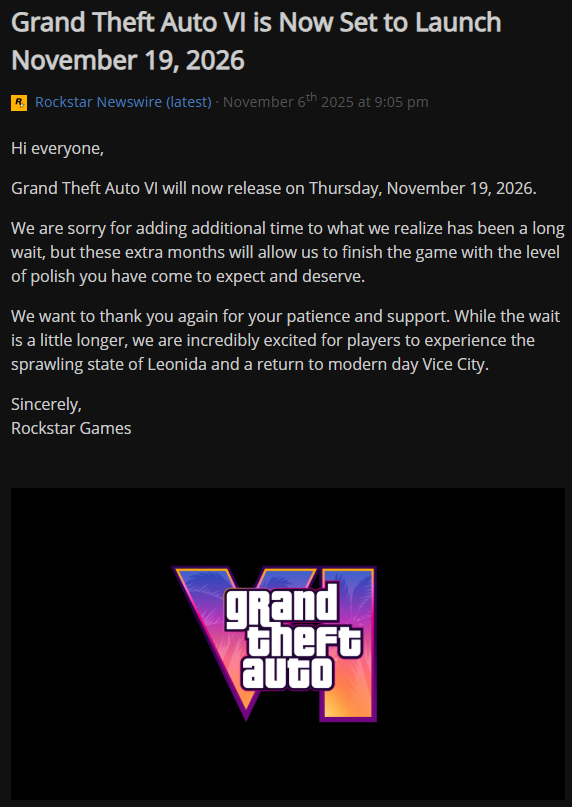

<!-- OPTION 1: Logo Above Text (Centered) -->
<div align="center">
  
  <h1>Rockstar Newswire Tracker</h1>
</div>


A lightweight, customizable, powerful tool to track the latest [Rockstar Games Newswire](https://www.rockstargames.com/newswire) updates. Automatically post news to your Discord server via Webhooks or serve a local RSS feed.

## Features
- **Discord Integration**: Seamlessly post new articles to your Discord channel.
- **Customizable Bot**: Configure the Discord bot's name, avatar, and date format.
- **RSS Feed**: Generates strictly typed RSS 2.0 feeds (`feed.xml`). Supports **Merged** (all genres in one feed) or **Separate** (one feed per genre) modes.
- **Multiple Categories**: specialized tracking for specific games like **GTA VI**, **Red Dead Online**, or general **Rockstar Announcements**.
- **Auto-Refresh**: Automatically polls for new content every 2 hours (configurable).


## Installation & Usage

### 1. Configuration
The application is configured via `config.yaml`.
1. Configure `config.yaml`.
2. Enable or disable features (`enableDiscord`, `enableRSS`, `mergeFeeds`).
3. Set your **Discord Webhook URL** (if using Discord integration).
4. Set the **Refresh Interval** in minutes (default is 120 minutes = 2 hours).
5. Uncomment the **genres** (news categories) you want to track. By default, only `latest` is enabled.

### 2. Running with Docker (Recommended)

```yaml
services:
  rockstar-newswire-tracker:
    image: nightmean/rockstar-newswire:latest
    container_name: rockstar-newswire-tracker
    restart: unless-stopped
    ports:
      - "3000:3000"
    volumes:
      # Mount config folder containing config.yaml and newswire.json
      - ./config:/usr/src/app/config
    environment:
      - P_SKIP_CHROMIUM_DOWNLOAD=true
      - PUPPETEER_EXECUTABLE_PATH=/usr/bin/google-chrome-stable
      - TZ=Europe/Bratislava
      # Optional: Override the webhook URL from config.yaml.
      # If not set here, it uses the value from ./config/config.yaml
      # - DISCORD_WEBHOOK_URL=https://discord.com/api/webhooks/...
```

2. Run the container:

```bash
docker-compose up -d
```

  - **Merged Mode (Default)**: `http://<your-docker-host>:3000/feed.xml`
  - **Separate Mode**: `http://<your-docker-host>:3000/feed-[genre].xml` (e.g., `http://<your-docker-host>:3000/feed-gta-online.xml`)
- Configuration (`config.yaml`) and data (`newswire.json`) are mounted as volumes, so you can edit config or check data without entering the container.

### 3. Running Locally (Node.js)
Ensure you have [Node.js](https://nodejs.org/) installed.

```bash
# Install dependencies
npm install

# Start the application
node index.js
```

## Configuration file (`config.yaml`)
```yaml
enableDiscord: true
enableRSS: true
mergeFeeds: false # true = one feed.xml; false = feed-genre.xml

# Discord Settings
webhookUrl: "YOUR_WEBHOOK_URL_HERE"
discordProfileName: "Rockstar Newswire Tracker"
discordAvatarUrl: "https://..."
dateFormat: "DD/MM/YYYY"

checkLimit: 5 # Check latest 5 articles per refresh
refreshInterval: 120 # Minutes
genres:
  - latest
  # - gta_online
```

## Supported News Types (Genres)
See `config.yaml` for the full list of supported genres. You can uncomment any genre in the file to enable tracking for it.

- `latest`
- `announcements`
- `grand_theft_auto_vi`
- `gta_online`
- `red_dead_online`
- ... and many others.

## Discord notification


## RSS feed (from FreshRSS)


## API Reference
For developers who want to integrate the newswire into their own applications:

```javascript
/* 
    Usage: new newswire(genre, options);
    genre: String (One of the supported categories)
    options: Object { 
        webhookUrl (string), 
        enableRSS (boolean), 
        refreshInterval (ms),
        discordProfileName (string),
        discordAvatarUrl (string),
        dateFormat (string),
        checkLimit (number)
    }
*/

const { newswire } = require('./newswire');
const tracker = new newswire('gta_online', {
    webhookUrl: 'https://discord.com/api/webhooks/...',
    enableRSS: true,
    refreshInterval: 7200000,
    discordProfileName: 'My Tracker', // Optional
    dateFormat: 'DD/MM/YYYY', // Optional
    checkLimit: 5 // Optional (Default: 5, Min: 1)
});
```

## Credits
- [Rockstar Games Newswire](https://www.rockstargames.com/newswire)
- [Puppeteer](https://www.npmjs.com/package/puppeteer) (Virtual browser for network tracing)
- [Feed](https://www.npmjs.com/package/feed) (RSS 2.0 generator)
- [js-yaml](https://www.npmjs.com/package/js-yaml) (YAML configuration parser)